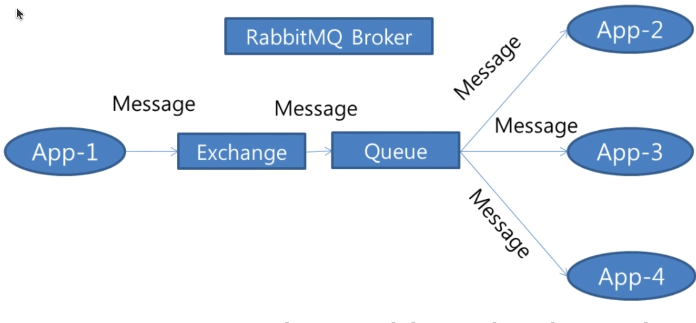

# rabbitmq-demo

Demo for rabbitmq

## Shell

```sh
nix-shell --run bash ./app.nix

nix-shell -p maven
mvn -N wrapper:wrapper -Dmaven=3.9.11

# Create maven parent project
mvnw archetype:generate \
    -DarchetypeGroupId=org.apache.maven.archetypes \
    -DarchetypeArtifactId=maven-archetype-quickstart \
    -DarchetypeVersion=1.5 \
    -DgroupId=com.ipostu.rabbitmq.demo.parent \
    -DartifactId=rabbitmq-demo-parent \
    -Dversion=1.0-SNAPSHOT \
    -DinteractiveMode=false

# add <packaging>pom</packaging>
# remove <dependencies>
# remove main/test folders

cd rabbitmq-demo-parent/

mvnw archetype:generate \
    -DinteractiveMode=false \
    -DgroupId=com.ipostu.rabbitmq.demo.program1 \
    -DartifactId=program1

# on standalone setup
# management-plugin should be enabled

docker pull rabbitmq:4.3.1-management-alpine

docker run -d \
  --name rabbitmq \
  -p 5672:5672 \
  -p 15672:15672 \
  rabbitmq:4.3.1-management-alpine

docker start rabbitmq

# http://localhost:15672
# username: guest
# password: guest

# JDK generate serialVersionUID
serialver -classpath boot1/target/classes/ com.ipostu.rabbitmq.demo.boot1.Person

## Rabbitmqctl
docker exec -it rabbitmq bash

rabbitmqctl status
rabbitmqctl list_queues
rabbitmqctl list_exchanges
rabbitmqctl list_users
rabbitmqctl list_queues name type leader members

rabbitmq-plugins enable rabbitmq_management
rabbitmq-plugins disable rabbitmq_management
rabbitmq-plugins list
```

## Other

- High Level Overview
  - 

- Types of exchanges
  - Direct
  - Fanout
  - Header
  - Topic
  - X-Local-Random Exchange - routes a message to one randomly selected queue that is local to the node where the message was published

- Install rabbitmq
  - install erlang OTP
  - install RabbitMQ

- Create queue without exchange
  - go to <http://localhost:15672> -> Queues -> Add queue
  - 

- Message arrives (Ready 2)
  - 
- Queues -> {queue name} -> Get messages
  - 

## Two consumers - RoundRobin distribution fashion

- `cd rabbitmq-demo-parent/`
- 2X `mvnw exec:java -Dexec.mainClass="com.ipostu.rabbitmq.demo.program1.Consumer" -f ./program1/pom.xml`
- 
- 

## Remove messages from the queue - purge

- Queues -> {queue name} -> Purge messages

or

- `rabbitmqctl purge_queue Queue-1`

## Direct exchange

- 

- Go to: Exchanges -> Add new exchange -> name:"Direct-Exchanges", type: Direct
  - create 3 queues(Classic): AC, Mobile, TV
- Go to Exchange: Direct-Exchanges
  - add bindings: AC -> routingKey: ac
  - add bindings: TV -> routingKey: tv
  - add bindings: Mobile -> routingKey: mobile

## Direct exchange - publish with missing routing key

- By default the message is silently dropped by RabbitMQ
- It CAN be returned to the producer if
  - on publish `mandatory` flag is `true`
  - AND we defined ob `channel` -> `ReturnListener addReturnListener(ReturnCallback returnCallback)`

## Direct exchange consumer

- Consumers do not know about exchanges, they work wih queues only

## Consumer program - threads analysis via VisualVM

- Consumers work async under the hood
  - program with 3 registered consumers
  - 
  - dummy java app (for comparison)
  - 

## Fanout exchange

- Unlike a direct exchange which routes messages based on a routing key, a fanout exchange sends messages to all bound queues
  - 
  - 
  - bind: AC and Mobile to the **Fanout-Exchange**
  - on publish, routing key must be empty string, not null

## Topic exchange

- 
- In a RabbitMQ topic exchange, routing is based on patterns in the binding key.
- Words are separated by dots
  - `*` (wildcard) Matches exactly one word.
  - `#` (hash) Matches zero or more words.
  - Topic routing keys are split by `.`.
  - No other wildcard syntax exists in RabbitMQ topic exchanges.
- Create `Topic-Exchange`
  - 
- And bndings
  - 

## Headers exchange

- 
- there is no routing key, headers are used instead
- `x-match` binding argument supports these values:
  - all, any, all-with-x, any-with-x
- What is `x-`?
  - Headers beginning with `x-` are normally treated as metadata and ignored during matching
    - all-with-x, any-with-x forces rabbit to treat them as regular headers
- Create `Headers-Exchange`, type=headers
- bind queue to the exchange
  - 
  - **order doesn't matter**

  ```txt
  Mobile
  x-match=any
  item1=mobile
  item2=mob
  ---
  TV
  item1=tv
  item2=television
  x-match=any
  ---
  AC
  item1=mobile
  item2=ac
  x-match=all
  ```

## Default exchange

- 
- When a message is sent directly to the queue (with empty exchange), the underline logic uses default exchange which is automatically bound to all queues
- can't be deleted

## Spring boot setup

- required dependencies

  ```xml
  <dependency>
      <groupId>org.springframework.boot</groupId>
      <artifactId>spring-boot-starter-amqp</artifactId>
  </dependency>

  <dependency>
      <groupId>org.springframework.amqp</groupId>
      <artifactId>spring-rabbit</artifactId>
      <scope>compile</scope>
  </dependency>
  ```

- send to queue `rabbitTemplate.convertAndSend("Mobile", person);`
- serialization is done on `SimpleMessageConverter`'s side
- by default it uses Java's serialization API via `SimpleMessageConverter`, so pojo must implement `Serializable`
  - to use jackson converter define explicitly:

    ```java
    @Bean
    public MessageConverter messageConverter() {
        return new JacksonJsonMessageConverter();
    }
    ```

- 
- 

## Erlang

- Concurrent & functional programming language
- Was developed in the 1980 by Joe Armstrong, Robert Wording and Mike Williams at Ericsson
- Primarily for telecommunications to handle millions of concurrent connections
- No downtime due to hot code update at language level
- Is actively used in messaging systems, financial systems and telecommunication

## Similar technologies

- JMS (Java message Service) - tied to java
- ActiveMQ
- ZeroMQ - no central broker / peer-to-peer communication / not as reliable
- IBM MQ (WebSphere MQ) - commercial

## RabbitMQ general aspects

### Message broker - pros

- Decoupled components - producers/consumers do not know about each other
- Async way of communication
- Enhanced scalability
- Fault tolerant - massages aren't lost if they arrive in RabbitMQ
- Multiple protocols, main one is AMPQ

### What problems does it solve

- Message queuing
- Message routing
- Guaranteed message delivery - message persistence and acknowledgments
- Load balancing
- Real time communication

### Is good for

- Microservices - indirect communication
- Event driven architecture
- Real-time systems

### Message broker

- A middleware that allows producers/consumers to communicate without knowing about each other
- Async
- Persistent
- Queuing
- Routing
- Transformation
- Handles delivery
- Decoupling

### Message broker - concepts

- Producer - app/service that produces message to RabbitMQ
- Consumer - app/service that receives message from RabbitMQ
- Queue - storage for messages
  - on acknowledgment message is removed from queue
- Exchange - routing mechanism
  - direct - by routing key
  - fanout - clones message to all queues
  - topic - pattern matching of routing key
  - headers - condition: all/any headers key values
- Binding - link between exchange and queue
- Routing key - string that determines where the message will go
  - is used by: direct and topic

  ---

- Message
  - body - any kind of data, including binary
  - metadata/headers/properties - key/value pairs

- Acknowledgment - signal that tells to the broker that consumer processed the message successfully
  - on success removes the message from the queue
  - on error the message is re-queued
- Virtual host - logical separation, no interference
- Clustering - distribute workload across multiple servers (single logical broker)
- Management plugins - web-based interface for management

## AMPQ - Advanced Message Queuing Protocol

- Open standard for messaging and is the primary protocol used by RabbitMQ
- defines the structure of messages, the interaction between brokers, producers and consumers in a messaging system
- Key Features
  - Reliable Delivery
  - Queuing
  - Routing
  - Security
  - Flow control (back-pressure)
- Interoperability

### MQTT (Message Queuing Telemetry Transport)

- IOT

### STOMP (Simple Text Oriented Messaging Protocol)

### HTTP

| Feature | AMQP | MQTT | STOMP | HTTP |
|----------|------|------|-------|------|
| Message Delivery Guarantees | Guaranteed delivery, persistent messages, acknowledgements | Basic delivery guarantees | Basic delivery guarantees | No guarantees for message delivery |
| Routing Flexibility | Complex routing with exchanges, routing keys, and bindings | Simple pub/sub model, no complex routing | Simple pub/sub model, no complex routing | No native routing, just request/response |
| Security | Advanced security features (authentication, encryption) | Limited security (depends on implementation) | Limited security (depends on implementation) | Limited security (depends on HTTPS setup) |
| Use Case | Large-scale, mission-critical, enterprise systems | IoT, low bandwidth environments | Simple messaging for web apps | Web-based applications, microservices |
| Protocol Complexity | More complex, feature-rich | Very simple, lightweight | Simple text-based protocol | Very simple, used for HTTP requests |

## AMPQ message structure

### Metadata/headers/properties

- Delivery Mode (transient/persistent)
- Message ID
- Timestamp
- Priority
- Content-Type
- Content-Encoding
- Correlation ID
- Reply-to
- TTL/Expiration
- User-Defined Headers

### Body/payload

- Text
- Binary Data
- Serialized Objects

### Acknowledgment

- on success consumer sends `ack` to the broker
- on failure consumer sends `nack` to the broker and re-queues the message
- if nothing is sent broker considers as failure and re-queues the message

## Limitations/shortcomings/cons RabbitMQ

- Performance overhead
  - to ensure durability it writes to the disk, which is less performant comparing to kafka
- Complexity in clustering
- Limited support for long running tasks
  - not good for case when the message arrives and ack/nack is replied late
- scaling and throughput limitation
- limited features for streaming processing

## RabbitMQ vs. Apache Kafka

- Message Delivery

  - RMQ uses message queues
  - Kafka uses topic-based

- Use Case

  - RMQ is best for real-time message brokering
  - Kafka is primarily designed for high throughput, distributed streaming

- Throughput

  - RMQ throughput is lower compared to Kafka (due to disk base ops)
  - Kafka is built for high throughput

- Message Durability

  - RMQ: messages can be made persistent
  - Kafka retains messages for a defined period

- Scaling

  - RMQ can scale horizontally
  - Kafka is designed for horizontal scaling

- Protocol Support

  - RMQ implements AMQP but also supports others
  - Kafka uses its own Kafka protocol

## Queue

- FIFO
- Types:
  - Simple queue
  - Circular queue
  - Priority queue
  - Double-Ended queue

- In erlang each queue is represented as a separate erlang process
  - process has its own state and processing logic
  - message lives in the process

## Network layer

- OSI (Open System Interconnection), layers:
  - Application
  - Presentation
  - Session
  - Transport
  - Network
  - Data link
  - Physical

- TCP(Transmission control protocol) / IP, layers:
  - Application
  - Transport
  - Internet
  - Link

RabbitMQ uses TCP sockets

## RabbitMQ Architecture

- Exchanges
  - direct
  - fanout
  - topic
  - headers
- Queues
  - durable queue (queue definition survives broker restart)
  - persistent message (producer) - same as durable, but related to the message
  - exclusive queue - used by the connection that created them, once the connection is closed the message is deleted
- Bindings
- Producers
- Consumers
  - supports multiple consumers per queue for parallel processing
- Channels
  - virtual connection inside the TCP connection
- Virtual Hosts
  - isolated environment
  - can be controlled via permissions
- Connections
  - TCP connection client->broker
- Acknowledgments
  - ack - success
  - nack - failure -> redeliver
  - timeout - failure -> redeliver
- Dead-letter - when TTL expires or after N redeliver failure actions the message goes to the special exchange for dead-letter
- Persistence(message) - persistent survives broker restart, non-persistent NOT

## Docker

- Images
- Containers
- Engine(server) / cli(client)
- Hub and Registries
- Volumes
- Network
  - Bridge - internal network shared across containers
  - Host - containers have an access to the host's network
  - Overlay - inter-host connection between containers

## RabbitMQ Ports

| Port | Purpose | Use Case | Protocol |
|------|---------|----------|----------|
| 5672 | AMQP (default) | Communication for producers and consumers | AMQP 0.9.1 / 1.0 |
| 15672 | HTTP Management UI | Web interface for RabbitMQ management | HTTP |
| 15692 | Prometheus HTTP Exporter | Exposing RabbitMQ metrics to Prometheus | HTTP / Prometheus |
| 25672 | Clustering / Inter-node communication | RMQ node-to-node clustering communication | Erlang distribution |
| 5671 | AMQP over TLS/SSL | Secure AMQP communication over TLS | AMQP over TLS/SSL |
| 4369 | EPMD (Erlang Port Mapper Daemon) | Discovery and communication between nodes | Erlang |
| 4368 | Stream Broker | Streaming messages in RabbitMQ | AMQP / HTTP |
| 9100 | STOMP over WebSocket | STOMP protocol over WebSockets | STOMP / WebSocket |
| 5673 | AMQP for another node or client | Alternative AMQP connection port for instances | AMQP |

## RabbitMQ Acknowledgment Modes

| Ack Mode | Description | When to Use |
|-----------|-------------|-------------|
| Nack Message Requeue True | Negative acknowledgment, message requeued for retry | Use for transient issues where retrying makes sense |
| Automatic Ack | Message automatically acknowledged when delivered to consumer | Use for stateless or non-critical message processing |
| Reject Requeue True | Message rejected but requeued for retry | Use when message needs reprocessing after failure |
| Reject Requeue False | Message rejected and discarded (not requeued) | Use for permanently invalid or useless messages |

**Reject Requeue True** and **Nack Message Requeue True** behave the same for a single message, but Nack can additionally reject multiple unacknowledged messages in one call.

## RabbitMQ Classic Queue vs Quorum Queue

| Feature | Classic Queue | Quorum Queue |
|----------|--------------|--------------|
| Architecture | Single leader queue, optional mirroring | Raft-based distributed queue |
| High Availability | Via mirrored queues (deprecated) | Built-in replication |
| Data Safety | Lower | Higher |
| Message Durability | Good | Very high |
| Failover | Can lose messages during failures | Automatic leader election with minimal message loss |
| Consistency | Eventual | Strong consistency (Raft consensus) |
| Throughput | Higher | Lower than Classic |
| Latency | Lower | Higher due to replication |
| Disk Usage | Less | More |
| Memory Usage | Less | More |
| Cluster Resilience | Moderate | High |
| Priority Queue Support | ✅ Yes | ❌ No |
| Lazy Queue Support | ✅ Yes | ❌ No |
| Dead Letter Exchange (DLX) | ✅ Yes | ✅ Yes |
| Message TTL | ✅ Yes | ✅ Yes |
| Publisher Confirms | ✅ Yes | ✅ Yes |
| Single Active Consumer | ✅ Yes | ✅ Yes |
| Recommended for New Deployments | Generally No | Yes |
| Best Use Case | High-throughput, less critical workloads | Business-critical workloads requiring reliability |

## Classic Queue

### Advantages

- Higher throughput
- Lower latency
- Lower disk and memory overhead
- Supports priority queues
- Suitable for temporary or non-critical workloads

### Disadvantages

- Mirrored queues are deprecated
- Less resilient during node failures
- Higher risk of message loss in cluster failures

### Typical Use Cases

- Logging
- Metrics collection
- Notification systems
- Temporary processing workloads

## Quorum Queue (quorum means majority)

### Advantages

- Built-in high availability
- Raft consensus ensures strong consistency
- Better protection against message loss
- Automatic leader election during node failures
- Recommended for production systems

### Disadvantages

- Higher resource consumption
- Lower throughput compared to Classic queues
- Does not support priority queues

### Typical Use Cases

- Order processing
- Payment processing
- Inventory management
- Event-driven microservices
- Workflow orchestration

## Rule of Thumb

```text
Business-critical messages -> Quorum Queue
High-throughput, less critical workloads -> Classic Queue
```

## RabbitMQ Classic Queue vs Quorum Queue

| Feature | Classic Queue | Quorum Queue |
|----------|--------------|--------------|
| Replication | Optional (Mirrored*) | Always (Raft-based) |
| Consistency | Weak (possible data loss) | Strong (data safety) |
| Performance | Faster | Slower due to replication |
| Failover | Manual (or Mirrored*) | Automatic leader election |
| Best For | Speed, simple workloads | High durability, critical data |

\* Mirrored Classic Queues are deprecated in modern RabbitMQ versions.

## Http API

```txt
http://localhost:15672/api/exchanges
```

- 

## Rabbitmq stream

# Stream

| Feature | Streams | Classic Queues | Quorum Queues |
|----------|----------|----------|----------|
| **Message Storage** | Log-based, messages stay for a set time | FIFO, messages are removed once consumed | FIFO, replicated across nodes |
| **Performance** | High-throughput | Medium | Medium |
| **Consumer Model** | Multiple consumers can read the same message at different times | Message is deleted after acknowledgment | Message is deleted after acknowledgment |
| **Replication** | Not Raft-based, but supports mirroring | None (single node) | Uses Raft-based replication |
| **Ordering** | Preserves strict ordering | Maintains FIFO order | Maintains FIFO order |
| **Use Case** | Event streaming, analytics, time series data | Traditional messaging | High availability, fault tolerance |

## Work with streams

```sh
rabbitmq-plugins enable rabbitmq_stream
rabbitmq-plugins enable rabbitmq_stream_management
```

We **CAN** publish message but **CANNOT** consume them via rabbitmq management UI

## Exchange

- Auto delete - if last queue is unbind then exchange  is deleted
- Internal - exchange to exchange communication ONLY
- Alternate Exchange (AE) - fallback exchange for messages that the primary exchange cannot route to any queue

## Naming convention

- Exchange good: `orders.exchange`
- Exchange good: `<appname>.orders.exchange`
- Queue good: `payment.processing.queue`

## Direct exchange

- If there are no queues bound to that routing key the message is lost

## Topic exchange

- test.* - exactly one
  - pass test.abc
  - do not pass test
  - do not pass test.abc.cde
- test.# - zero or many
  - pass test.abc
  - pass test
  - pass test.abc.cde

## Messaging patterns

- **Simple Queue Pattern** — A producer sends messages to a queue, and a single consumer processes them one at a time.

- **Work/Task Queue Pattern** — Multiple workers share a queue to distribute and process tasks in parallel.

- **Pub-Sub (Fanout) Pattern** — A message is broadcast to all subscribed consumers simultaneously.

- **Routing Pattern** — Messages are delivered to specific consumers based on routing keys or rules.

- **Dead Letter Pattern** — Failed, rejected, or expired messages are moved to a separate queue for analysis or retry.

- **Delayed Messaging Pattern** — Messages are held for a specified time before being delivered to consumers.

- **Request-Reply Pattern** — A client sends a request message and waits for a corresponding response message.

## Dead letter exchange

- create
  - exchange `x.dlx`
    - `q.dead.letter`
    - bind with routing key `main`
  - exchange `x.direct`
    - `q.main` (`x-dead-letter-exchange=x.dlx`)
    - bind with routing key `main`

Observation 1: routing key is set automatically `main` when the message is sent from `q.main` to `x.dlx`

Observation 2: if the message is published using default exchange, it won't be dead lettered in case of failure (because the routing key is `q.main`)

- 
- 
- `q.dead.letter` is empty

Observation 3: publishing to the exchange with routing key `main`

- 
- 
- 
- 

Observation 4:

- publish message to `x.direct` with routing key `q.main`
  - error: Message published, but not routed.

- publish message to `(AMQP default)` with routing key `q.main`
  - Message published.
- message is present in `q.main`
- `Reject requeue false`
- Message was removed and NOT moved to the `q.dead.letter` because routing key didn't match

- **Problem!!!** we will need to create for each routing key a separate dead letter queue, solution is dead letter routing key

## Dead letter exchange - dead letter routing key

- create/use existing
  - existing exchange `x.dlx`
    - `q.dead.letter2`
    - bind with routing key `dead-letter-key`
  - existing exchange `x.direct`
    - `q.main2` (`x-dead-letter-exchange=x.dlx` **AND** `x-dead-letter-routing-key=dead-letter-key`)
    - bind with routing key `main2`

- publish message with routing key `main2`
- message appears in the `q.main2`
- Get message: `reject requeue false`
- Message goes to `q.dead.letter2`

## Dead letter exchange - queue with x-message-ttl AND x-max-length

- x-message-ttl - milliseconds
- x-max-length - max number of messages in the queue, if greater than remove from the end

Create a queue `q.main3`

- `x-message-ttl=20000`
- `x-max-length=10`
- `x-dead-letter-exchange=x.dlx`
- `x-dead-letter-routing-key=dead-letter-key`
- bind to `x.direct`, routing key `main3`
- publish message
  - it appears in the queue
  - after 20 seconds it is dead lettered
- publish 11 messages, first one is dead lettered

## References

- test41done
